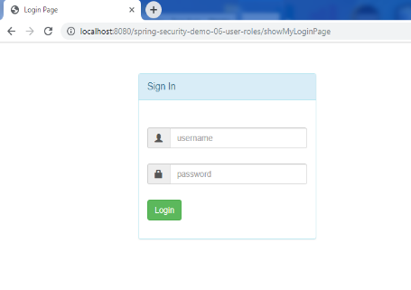

<h3>Development Process</h3>
1. Add Maven dependencies for Spring MVC Web App
	<li>Spring mvc,spring security,servlet,jsp,jstl,maven war plugin</li>
	<li>The WAR Plugin is responsible for collecting all artifact dependencies, 
	classes and resources of the web application and packaging them into a web 
	application archive</li>
2. Create Spring App Configuration and Security Configuration 
3. Create Spring Dispatcher Servlet Initializer and Security Web App Initializer 
4. Develop Spring Controllers 
5. Develop JSP view pages  

<b>Sign in page:</b> 

<b>Invalid username or password :</b> 

<b>Employee role's home :</b> 

<b>After log out :</b> 

<b>Manager role's home :</b> 

<b>Only manager role's access page :</b> 

<b>Admin role's home :</b> 

<b>Only admin role's access page :</b> 

<b>Access Denied Page :</b> 

