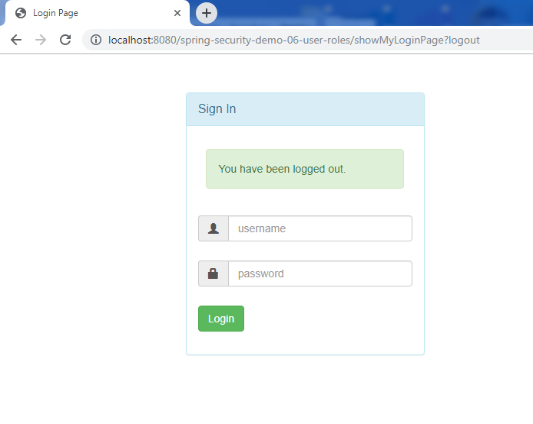

<h3>Development Process</h3>
1. Add Maven dependencies ->
	<li>Spring mvc-web,spring security,servlet,jsp,jstl,mysql,c3p0 and maven war plugin</li>
2. Create database for authorities.
3. Create Spring App Configuration and Security Configuration 
4. Create Spring Dispatcher Servlet Initializer and Security Web App Initializer 
5. Develop Spring Controllers 
6. Develop JSP view pages 

This demo same as demo-01. Differences are the authorities user and password provided by database, also password stores as bcrypt. 

<b>Sign in page:</b> 

<b>Invalid username or password :</b> 

<b>Employee role's home :</b> 

<b>After log out :</b> 

<b>Manager role's home :</b> 

<b>Only manager role's access page :</b> 

<b>Admin role's home :</b> 

<b>Only admin role's access page :</b> 

<b>Access Denied Page :</b> 

